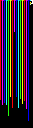

# Source code for Digital Alchemy Course: TXT&IMG

Gathered togther resources for generating piet programs out of string input. Inspiried  by [this article: "Making Poetry in Piet" by Daniel Holden](http://theorangeduck.com/page/making-poetry-piet)

Source files are taken from: 

[this challenge](https://codegolf.stackexchange.com/questions/48820/string-to-image)

Other resources
- [piet compiler](http://www.bertnase.de/npiet/)
- [IDE](https://gabriellesc.github.io/piet/)
